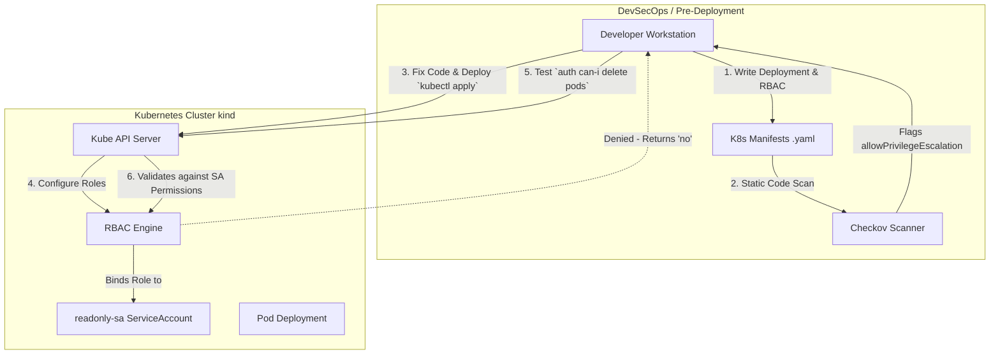

# Lab 07: Securing Kubernetes and Enforcing Policy

## Aim
To audit Kubernetes manifests statically for over-privileged workloads and enforce strict Role-Based Access Control (RBAC) policies within a live container cluster to maintain least privilege.

---

## Architecture Diagram



---

## Tools Required
* **kind (Kubernetes in Docker):** Used to rapidly provision a lightweight, throwaway local cluster for testing.
* **kubectl:** The primary CLI for communicating with the Kubernetes control plane.
* **Checkov (CLI):** A static code analysis tool used to evaluate IaC files against hundreds of security best practices.

---

## Execution Steps

### 1. Static Manifest Analysis
1. Create a Kubernetes deployment YAML containing an insecure `securityContext` (`allowPrivilegeEscalation: true`).
2. Run Checkov locally to scan the directory:
   ```bash
   checkov -d ./k8s-manifests
   ```
3. Analyze the results to identify critical Kubernetes misconfigurations (e.g., CKV_K8S_20).

### 2. Live Cluster Security Testing
1. Provision a local cluster:
   ```bash
   kind create cluster
   ```
2. Apply a strict RBAC policy mapping a service account to a read-only role:
   ```bash
   kubectl apply -f role.yaml
   ```
3. Test the enforcement of the policy by attempting an unauthorized action using the service account's identity:
   ```bash
   kubectl auth can-i delete pods --as=system:serviceaccount:default:readonly-sa
   ```
4. Verify that the API server denies the action (Output: `no`).

---

## Screenshots

### 1. Checkov Manifest Failure
*(Student: Insert your terminal screenshot here showing Checkov flagging the over-privileged pod configuration)*

### 2. Kubernetes RBAC Enforcement
*(Student: Insert your terminal screenshot here showing the cluster creation and the blocked `delete pods` action)*

---

## Result
* Successfully shifted cluster security left by integrating static manifest scanning via Checkov prior to deployment.
* Successfully instantiated a local test cluster and enforced strict API-level access controls using Kubernetes RBAC, mitigating lateral movement and privilege escalation risks.
